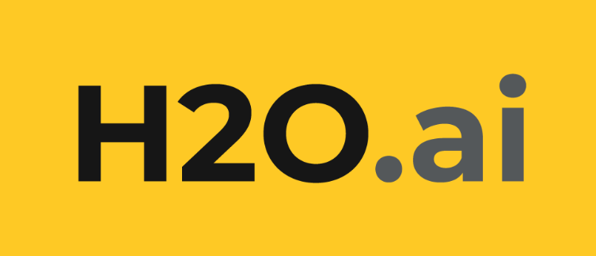
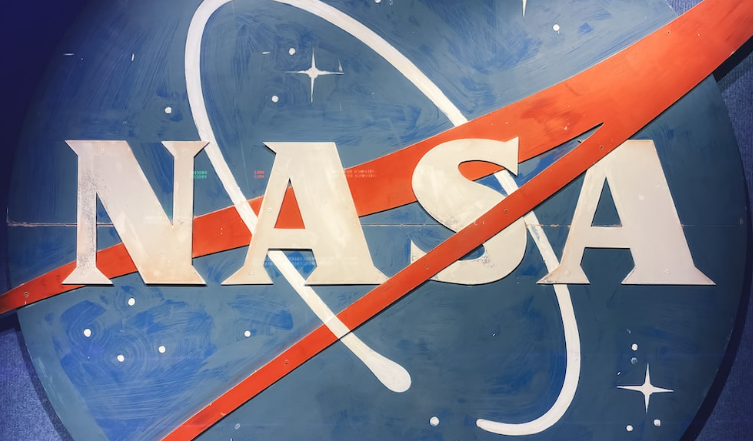
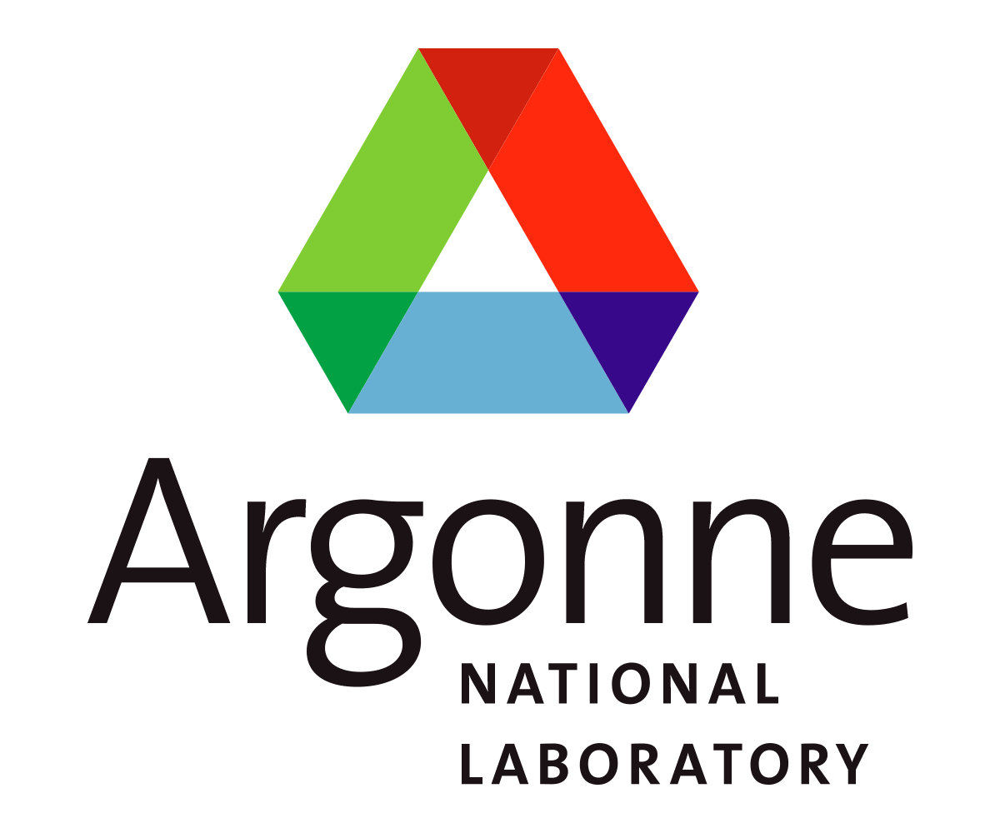
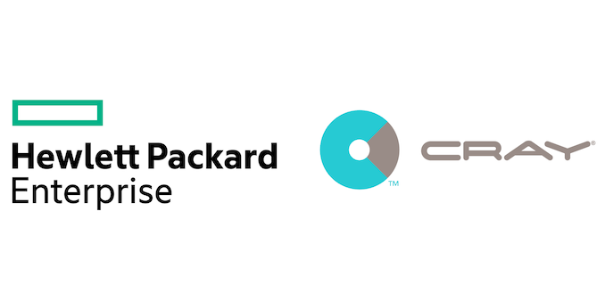

# Deep Learning Ultra
Open source Deep Learning Containers (DLCs) are a set of Docker images for training and serving models in PyTorch, OpenCV (compiled for GPU), TensorFlow 2 for GPU, PyG and NVIDIA RAPIDS, running on CUDA 12.1.

### Used and adopted by many!

|  |     |     |
| :---:   | :---: | :---: |
|  |    |   |
|  |    |   |


### Ultra easy deployment

Edit line 17 in docker-compose.yaml for however many GPUs you have: ```count: 3  # num of gpus```, then run:

```docker compose up --build -d```


### Requirements
 - Linux configured with ```nvidia_docker2```, CUDA 12, NVIDIA Drivers v.525+
 - NVIDIA GPU ```-ARCH_7.5+```


## Deep Learning Container Services

1. Deep Learning Notebook, or you can mount VSCode to ```/app``` | [http://localhost:8888](http://localhost:8888)
2. MLFlow is an open source platform for managing the end-to-end machine learning lifecycle, see more [here](https://mlflow.org/docs/latest/what-is-mlflow.html) 
 | [http://localhost:5000](http://localhost:5000)
3. Tensorboard povides the visualization and tooling needed for machine learning experimentation | [http://localhost:6006](http://localhost:6006)

 - <strong>Deep learning solution</strong>  - all python bindings specifically compiled for c++/CUDA:
   - Pytorch 2
   - PyG (Graph Neural Networks)
   - NVIDIA RAPIDS
   - OpenCV v4.8
   - TensorFlow 2
    
 - CuPy, Anaconda Python v11.5, Captum and more!
   
 - Supports LLMs, HuggingFace, Computer Vision, Navigation, Physics Informed ML, and Graph Neural Networks

----------------------------------------------------------------------------


